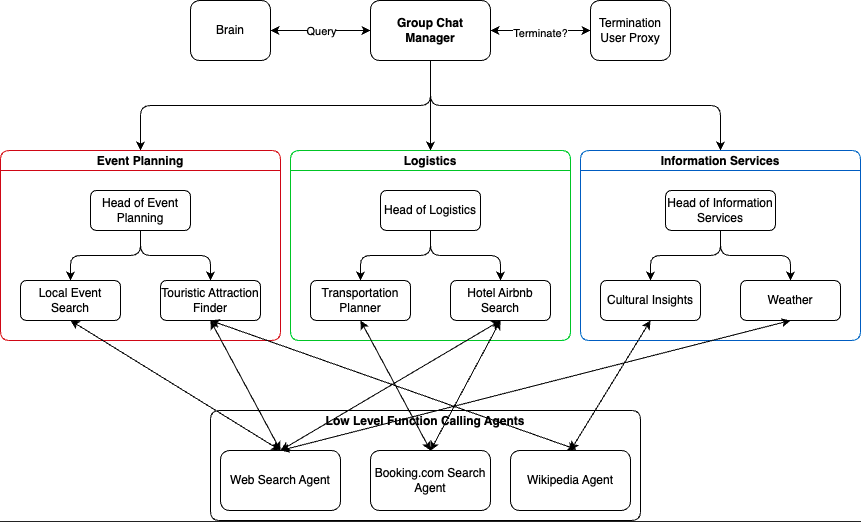

# TripChat: A Long-Term Planning Agent Hierarchy for Travel

## Overview

TripChat revolutionizes travel planning by employing a hierarchical agent structure, where agents with diverse responsibilities collaborate to create a comprehensive trip plan. This structure allows for efficient division of tasks such as finding local events, hotels, flights, and more.

### Key Features

- **Hierarchical Agent Structure**: Different teams and agents work together for a unified goal, enhancing the efficiency of travel planning.
- **Microsoft’s Autogen Framework**: Utilizes the Autogen framework for multi-agent systems and GroupChat for agent communication.
- **Langchain Framework**: Low-level agent implementation for direct interaction with external tools and APIs.
- **Shared JSON Object**: A collaborative approach where each agent updates a shared object, akin to a collective Google Doc.
- **Diverse Agent Types**: Includes proxy, assistant, and GptAssistants, each with specific roles and capabilities.

## Installation and Setup

1. **Install Dependencies**: Start by installing necessary dependencies from `requirements.txt`.
2. **Configure API Keys**: Modify the `keys.json` file with the relevant API keys. We use [this](https://rapidapi.com/DataCrawler/api/booking-com15) Booking.com API.
3. **Running the Application**: Navigate to the `src/` folder and run `python3 main.py`.

## Usage

After running `main.py`, provide a query detailing your trip plan requirements (dates, destinations, etc.). The system will guide you through the process.

## Agent System

- **GroupChat Dynamics**: Agents communicate in rounds, with a manager coordinating the discussion.
- **Role-Based Communication**: Agents are aware of their team members' capabilities and communication is structured accordingly.
- **Speaker Selection Logic**: A novel approach to select speakers, enhancing the hierarchy and communication flow.
- **Functionality**: Agents use specific functions for updating the shared plan and interacting with external tools.

## Acknowledgments

Special thanks to CS194 Berkeley course staff for their continued support.

---

_TripChat - Streamlining travel planning through innovative agent collaboration._
